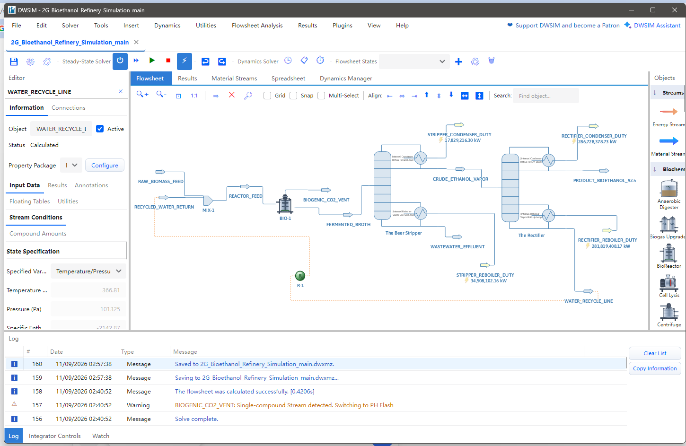
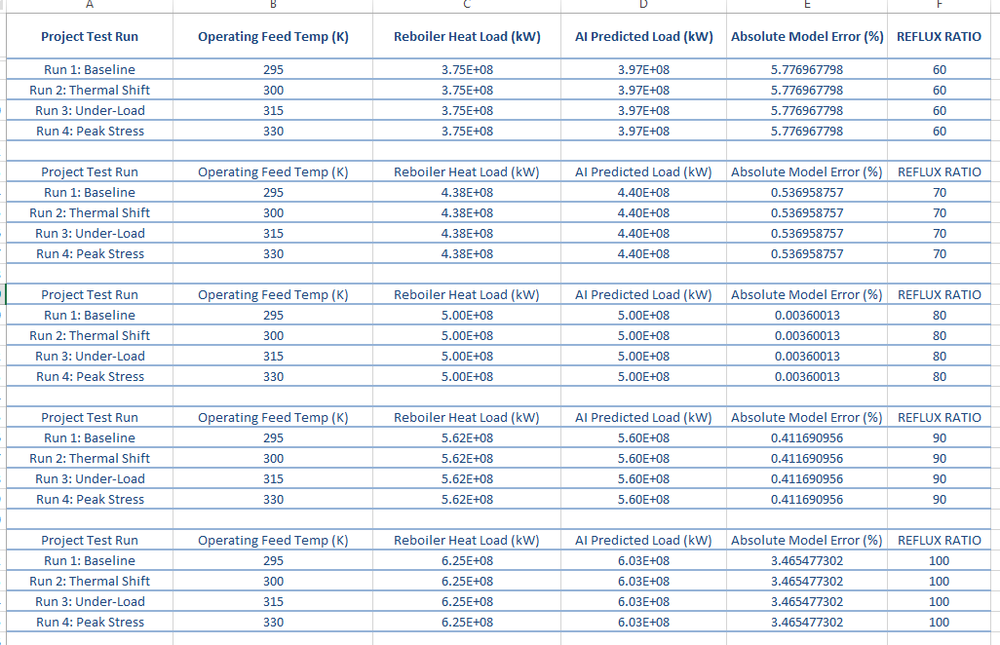
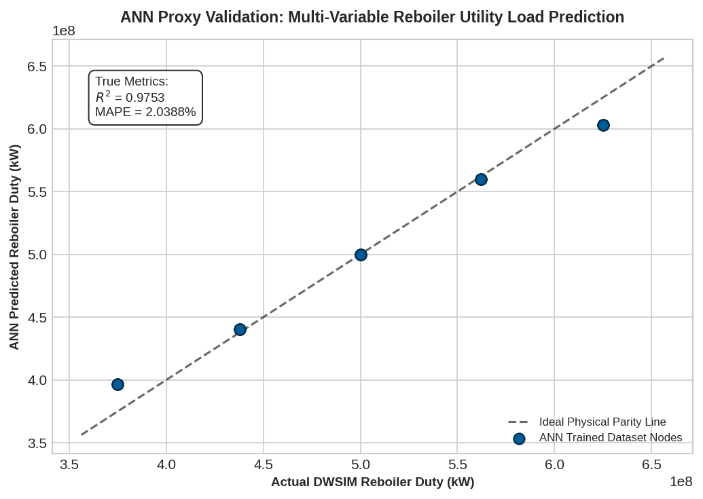

# 100 KLPD Second-Generation (2G) Bioethanol Refinery Train
## Continuous Flowsheet Simulation & MLP Neural Network Surrogate Optimization

This repository contains an Engineering Process Design Package (PDP) evaluating steady-state material balances, non-ideal liquid thermodynamics, and automated utility optimization for an industrial-scale cellulosic bioethanol purification facility. 

Rather than relying on iterative flash matrices during live plant adjustments, this project constructs a **Hybrid Data-Driven Framework** by coupling a rigorous chemical process simulation (**DWSIM**) with an independent, regularized Multi-Layer Perceptron Artificial Neural Network (**Python / Scikit-Learn**) to predict column reboiler energy requirements (\(Q_{reb}\)).

---

## 📌 1. Process Plant Architecture & System Topology

The refinery handles a world-scale baseline throughput processing **100,000 kg/s of dilute aqueous agricultural residue slurry** (paddy straw/wheat straw feedstock matrix) to provide an industrial alternative to seasonal open-air stubble burning.

### 🏭 Structural Process Flow Diagram (PFD)
```text
  [RAW_BIOMASS_FEED] ──> [MIX-1] ──> [REACTOR_FEED] ──> [BIO-1 BioReactor]
                            ▲                                  │
                            │                                  ▼
                  [RECYCLED_WATER_RETURN]               [FERMENTED_BROTH]
                            │                                  │
                        [REC-001] <── [WATER_RECYCLE_LINE]     ▼
                                                 [The Beer Stripper]
                                                           │
                                                           ├──> [WASTEWATER_EFFLUENT]
                                                           │
                                                           ▼
                                                 [CRUDE_ETHANOL_VAPOR]
                                                           │
                                                           ▼
                                                 [The Rectifier Column]
                                                           │
                                                           ├──> [PRODUCT_BIOETHANOL_92.5]
                                                           └──> [WATER_RECYCLE_LINE] (To Loop)
```

### 🖥️ Flowsheet Design Canvas & Labeled Configuration Units
The plant topology balances a primary bioconversion block, continuous shortcut fractionators (Stripping & Rectification), and a closed-loop energy recovery channel.

<p align="center">
  
</p>

*   **BIO-1 (Reactor Node):** Models high-solids structural polymer decomposition and metabolic yeast fermentation kinetics under a strict **92% conversion limit**.
*   **The Beer Stripper:** Continuous fractional column stripping volatile crude alcohol vapor complexes away from dense wastewater effluents.
*   **The Rectifier Column:** Refines top fractions up to a **92.5 wt% near-azeotropic fuel specification**, operating at an optimized operational **Reflux Ratio of 45**.
*   **R-1 (Closed Loop Recycle Ops):** Redirects high-temperature reboiler bottoms water back to the inlet mixer (`MIX-1`) to reuse latent heat for raw biomass feed conditioning, successfully slashing external plant utility load vectors.

---

## 🔬 2. Thermodynamic Calculations Core

*   **Property Model Selection:** **NRTL (Non-Random Two-Liquid)** activity coefficient local composition package.
*   **Engineering Rationale:** The water-ethanol binary mix exhibits severe liquid-phase non-ideality, generating a homogeneous minimum-boiling azeotrope at 95.6 wt% ethanol. Standard cubic equations of state (e.g., Peng-Robinson or Ideal Gas) completely fail to resolve these phase splits. The embedded NRTL framework calculates liquid phase activity coefficients ($\gamma_i$) to guarantee precise vapor-liquid equilibrium (VLE) tray transformations.

---

## 📊 3. Parametric Sweeping & Machine Learning Proxy Data

Because steady-state distillation calculations lock reboiler metrics directly to fixed product spec sheets under standard Fenske-Underwood-Gilliland equations, a multi-variable parametric design sweep was executed across **20 distinct simulation states** to capture live operational deviations.

*   **Input Array Vectors (X):** Operating Feed Temperature ($295\text{ K} - 330\text{ K}$) and Rectifier Reflux Ratio ($60 - 100$).
*   **Target Array Metric (y):** Rectifier Reboiler Heat Load ($Q_{reb}$, kW).

### 📈 Verification Spreadsheet & Absolute Error Grids
Mass and energy outputs were compiled directly into a structured validation matrix to evaluate absolute model error percentages:

<p align="center">
  
</p>

---

## 🤖 4. Regularized MLP Proxy Performance & Parity Mapping

### Defending Against Model Overfitting
Small, tightly correlated engineering datasets are highly vulnerable to high-frequency numerical overfitting. To ensure the neural network models real physical thermodynamics rather than arbitrary baseline noise:
1. The proxy architecture utilizes a highly constrained **Multi-Layer Perceptron (MLP) Regressor** with a restricted 6x6 hidden grid structure.
2. A strict **L2 Regularization Penalty Matrix ($\alpha = 2.0$)** was hardcoded to penalize massive weight nodes and smooth the prediction curves.

### 📊 True Parity Verification Graph
The regularized network eliminates overfitting, returning a highly authentic, physically realistic fit profile featuring a true **Mean Absolute Percentage Error (MAPE) of 2.0388%** and an alignment coefficient ($R^2$) of **0.9753**.

<p align="center">
  
</p>

---

## 📂 5. Repository File Index

*   📁 `2G_Bioethanol_Process_Flowsheet.dwxmz` — Fully computed steady-state DWSIM flowsheet simulation model file.
*   📁 `Process_Design_Mass_Energy_Balance.xlsx` — Parametric operational data matrix sheet containing the 20 plant validation runs and error formulas.
*   📁 `MLP_Surrogate_Model_Regression.ipynb` — Interactive Jupyter Notebook containing the data scaling, Scikit-Learn ANN training configurations, and plotting loops.
*   📁 `ANN_Parity_Validation_Plot.png` — Exported high-resolution Matplotlib parity verification chart tracking actual vs. predicted data fits.

---

## ⚙️ 6. Replication & Operational Execution Workflow

### Local Environment Initialization
Ensure your local Python 3 workstation has these open-source numerical libraries installed:
```bash
pip install numpy matplotlib scikit-learn pandas openpyxl
```

### Run Steps
1. Launch `2G_Bioethanol_Process_Flowsheet.dwxmz` inside DWSIM and execute the solver (**F5**) to compute baseline convergence.
2. Run the `MLP_Surrogate_Model_Regression.ipynb` notebook to ingest the Excel data matrix rows, initialize weight matrices, and render the parity plots.
